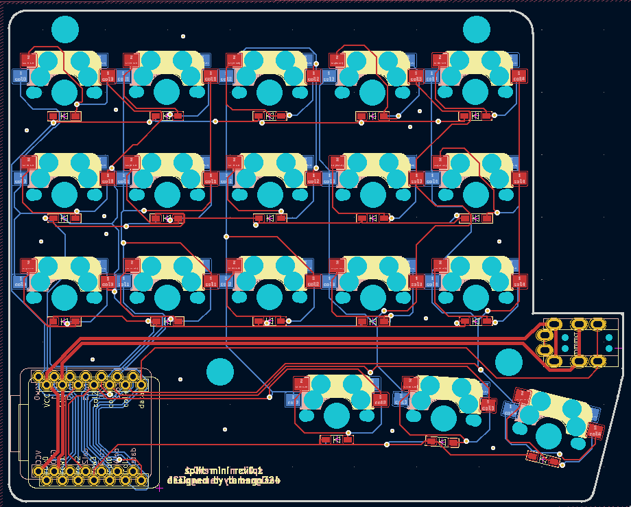

# split mini rev0.1

* XIAO RP2040 を使用
* [KLE](http://www.keyboard-layout-editor.com/#/gists/fbe317ca72d8030fb684be89b4dfa688)
* https://kbplate.ai03.com/ でプレートデータを作成
  * width: 16.5
  * height: 16.5

* 左右分割キーボード
* 狭ピッチ

