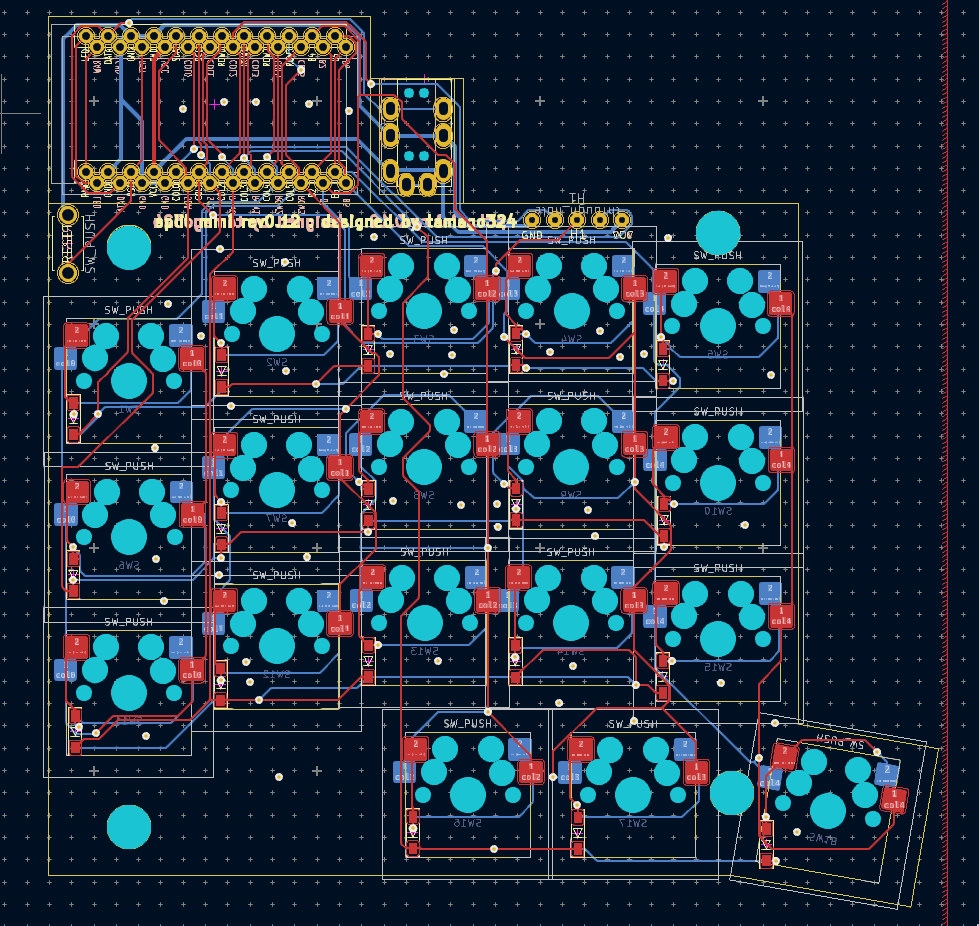
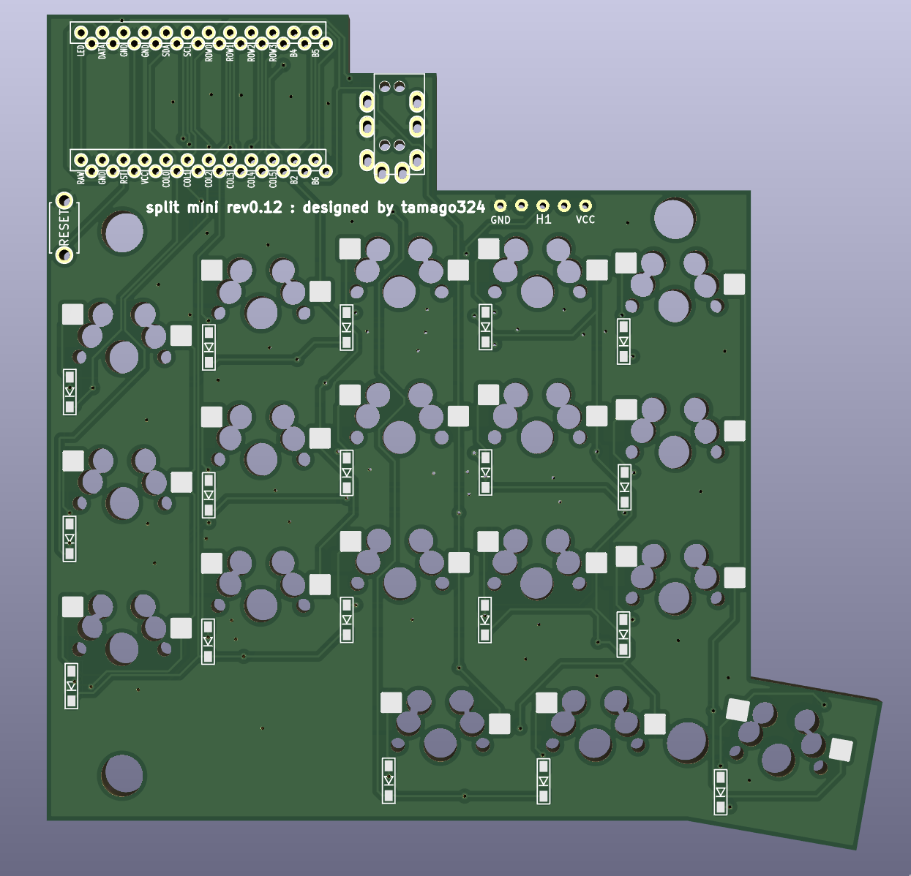

## split mini rev0.12

* ProMicro を使用
* [KLE](http://www.keyboard-layout-editor.com/##@_name=split%20mini%20rev0.13&notes=oyayubi%20ga%201.25%20ninatteiruyatu%0Amata,%20tatewo%2017.5%20ni%20sitai%3B&@_y:0.75&x:3&a:7%3B&=&=%3B&@_y:-0.9&x:5%3B&=%3B&@_y:-0.9500000000000001&x:2%3B&=%3B&@_y:-0.7&x:1%3B&=%3B&@_y:-0.44999999999999996&x:3%3B&=&=%3B&@_y:-0.8999999999999999&x:5%3B&=%3B&@_y:-0.9500000000000002&x:2%3B&=%3B&@_y:-0.6999999999999997&x:1%3B&=%3B&@_y:-0.4500000000000002&x:3%3B&=&=%3B&@_y:-0.8999999999999999&x:5%3B&=%3B&@_y:-0.9500000000000002&x:2%3B&=%3B&@_y:-0.6999999999999997&x:1%3B&=%3B&@_y:-0.3500000000000001&x:3.3%3B&=&_w:1.25%3B&=%3B&@_r:10&y:-2.05&x:6.3&w:1.25%3B&=)
* https://kbplate.ai03.com/ でプレートデータを作成
  * width: 16.5
  * height: 17.5
* 左右分割キーボード
* 狭ピッチ
  * キーキャップは専用のものを使う (底面が16mmのやつを使うことにする)
* MX 対応
* 100mmx100mm以下のため、Elecrow で1ドルで発注可能
  * PCB、トッププレート1つ、ボトムプレートの3つを3ドルで発注できて、2セット組み立てられる
* Trackball module をつけられる
  * 線をはんだ付けすることで使用可能になる想定
  * Aliexpress で売っているもの
    * [ケーブル](https://ja.aliexpress.com/item/4000898605030.html?spm=a2g0o.order_list.order_list_main.5.2968585aQbozum&gatewayAdapt=glo2jpn)
    * [コネクタ](https://ja.aliexpress.com/item/4001115739803.html?spm=a2g0o.order_list.order_list_main.11.2968585aQbozum&gatewayAdapt=glo2jpn)

## Pictures

### PCB

### Top plate

### bottom plate
