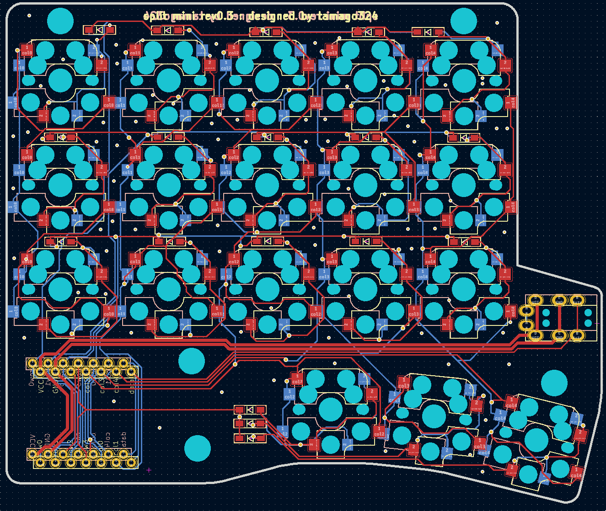
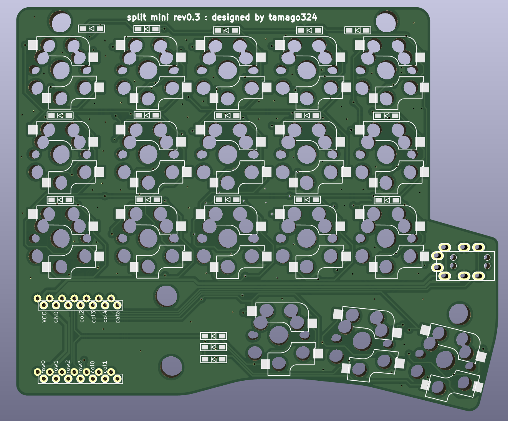
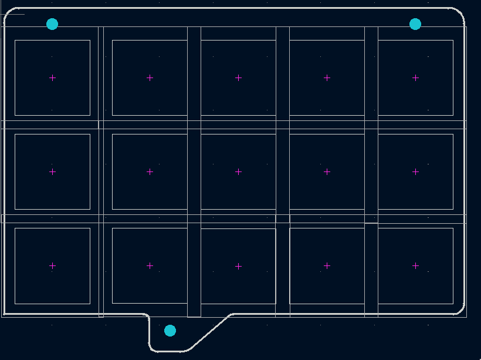
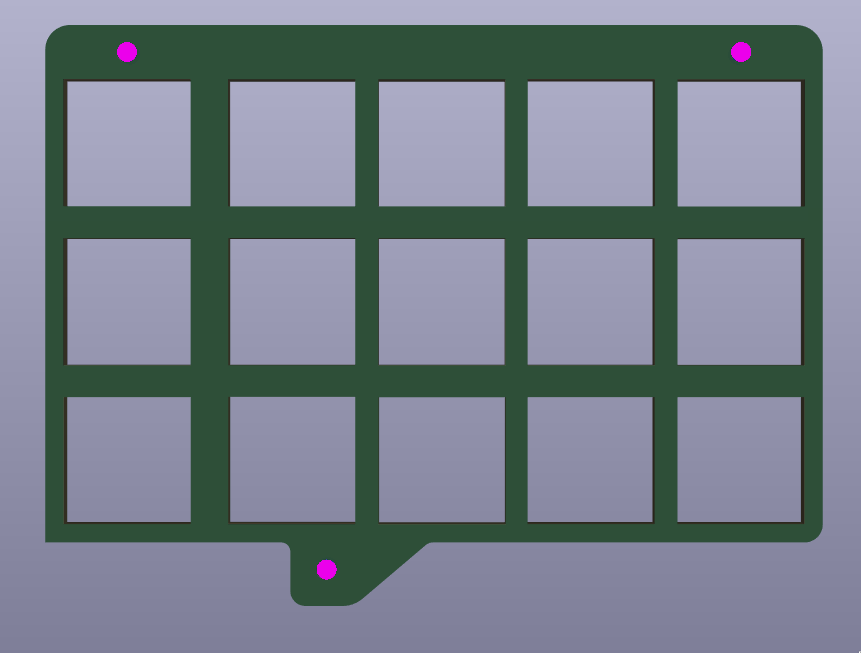
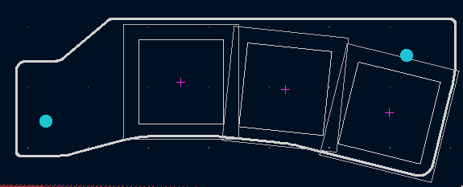
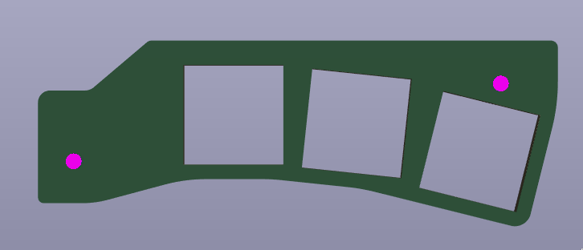

## split mini rev0.2

* XIAO RP2040 を使用
* [KLE](http://www.keyboard-layout-editor.com/#/gists/d7ed01c506e9d3b2c2adfb04fcaa3432)
* https://kbplate.ai03.com/ でプレートデータを作成
  * width: 16.5
  * height: 17.5

* 左右分割キーボード
* 狭ピッチ
  * キーキャップは専用のものを使う (底面が16mmのやつを使うことにする)
* MX/Choc 対応

## Pictures

### PCB

### Top plate

#### 親指以外

#### その他の指部分

