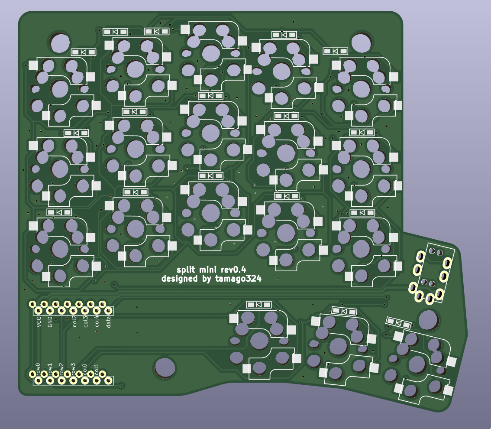

## split mini rev0.4

* XIAO RP2040 を使用
* [KLE]()
* https://kbplate.ai03.com/ でプレートデータを作成
  * width: 16.5
  * height: 17.5
* 左右分割キーボード
* 狭ピッチ
  * キーキャップは専用のものを使う (底面が16mmのやつを使うことにする)
* MX/Choc 対応
* 100mmx100mm以下のため、Elecrow で1ドルで発注可能
  * PCB、トッププレート、ボトムプレートの3つを4ドルで発注できて、2セット組み立てられる
* [QMK firmware](https://github.com/tamago324/qmk_firmware/tree/tamago324/keyboards/tamago324/splitmini)

## Pictures

### PCB

### Top plate

#### 親指以外

#### 親指部分

