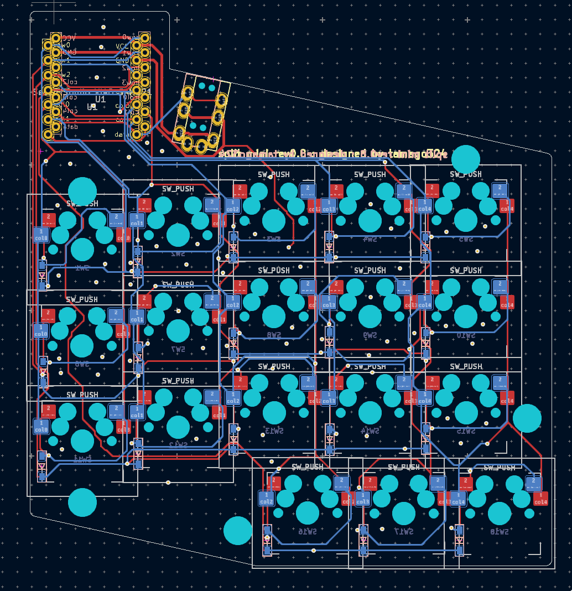
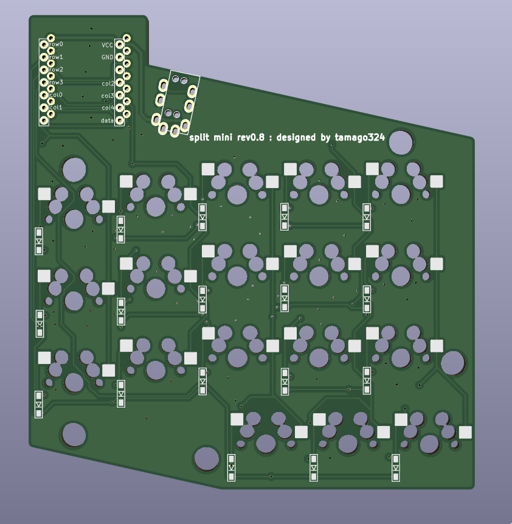

## split mini rev0.8

* XIAO RP2040 を使用
* [KLE](http://www.keyboard-layout-editor.com/#/gists/0a0b76c4f924ff4c73d4389a95592d19)
* https://kbplate.ai03.com/ でプレートデータを作成
  * width: 16.5
  * height: 16.5
* 左右分割キーボード
* 狭ピッチ
  * キーキャップは専用のものを使う (底面が16mmのやつを使うことにする)
* MX 対応
* 100mmx100mm以下のため、Elecrow で1ドルで発注可能
  * PCB、トッププレート1つ、ボトムプレートの3つを3ドルで発注できて、2セット組み立てられる
* [QMK firmware](https://github.com/tamago324/qmk_firmware/tree/tamago324/keyboards/tamago324/splitmini)

### ケースを使いたいとき

* メインPCB は1mmにする
* スペーサーは9mm にすると、1.5mmのPORONをひける！

## Pictures

### PCB

### Top plate

### bottom plate
