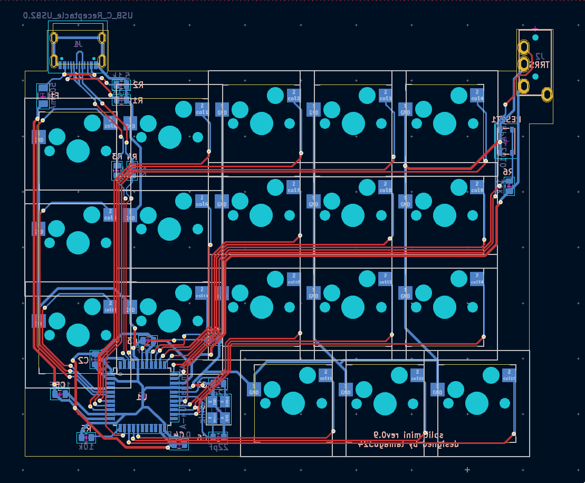
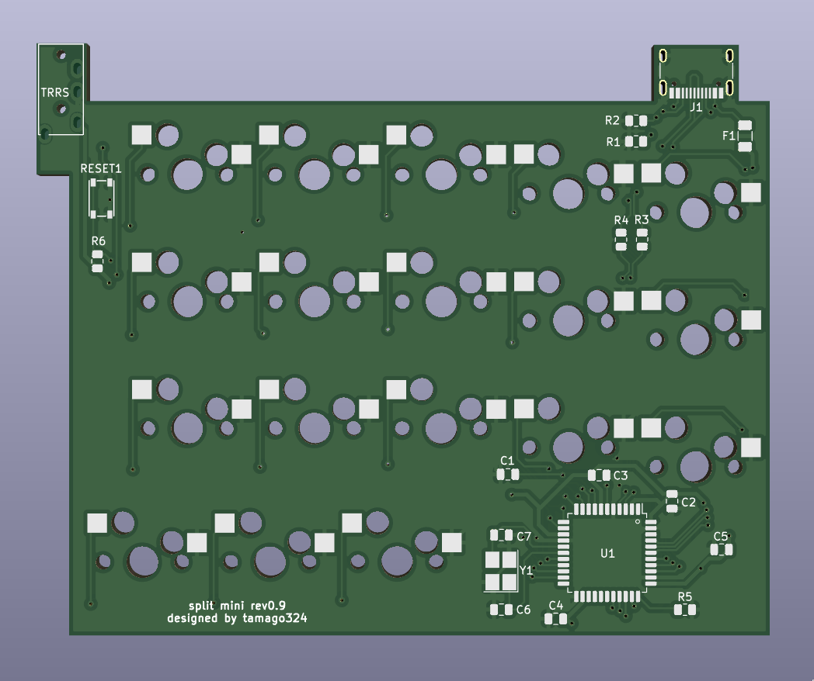
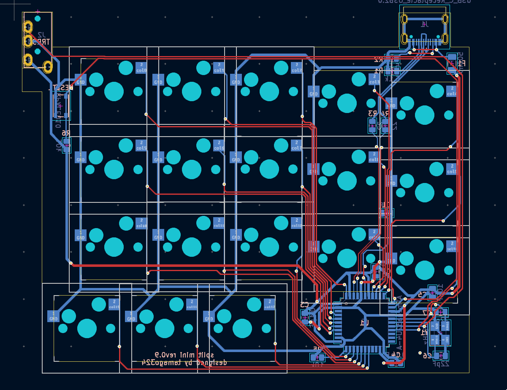
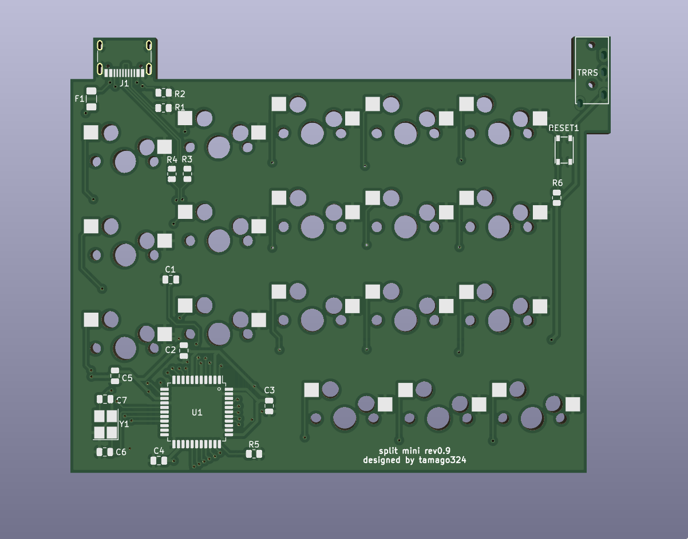
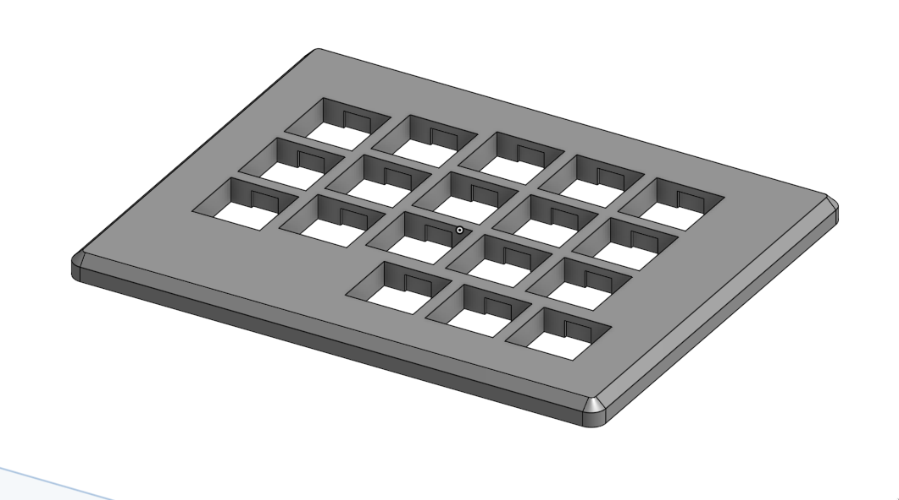
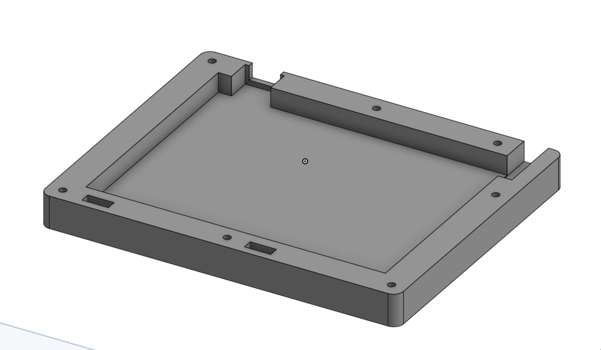
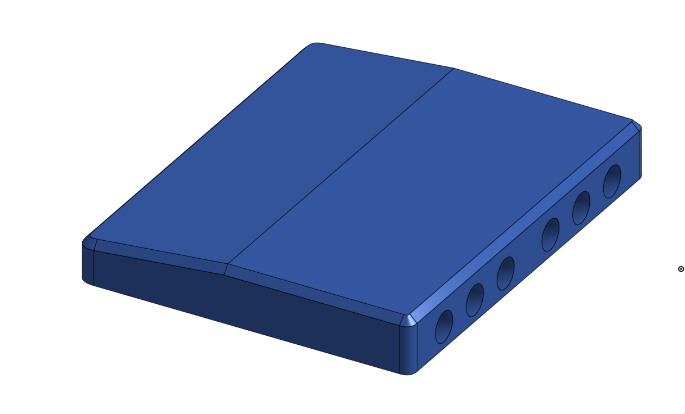

## split mini rev0.9

* [KLE](http://www.keyboard-layout-editor.com/#/gists/249dbe1a0262937117484ad3b4d1d6fd)
* https://kbplate.ai03.com/ でプレートデータを作成
  * width: 16.5
  * height: 16.5
* 左右分割キーボード
* 狭ピッチ
  * キーキャップは専用のものを使う (底面が16mmのやつを使うことにする)
  * [雰囲気で作ったキーキャップ](https://github.com/tamago324/small-keycaps)
* MXのみ 対応
* 100mmx100mm以下のため、Elecrow で1ドルで発注可能
* [QMK firmware](https://github.com/tamago324/qmk_firmware/tree/tamago324/keyboards/tamago324/splitmini)
  * rev09 のディレクトリのため、`nix-shell --run 'sudo make tamago324/splitmini/rev09:tamago324:flash'` のようにして書き込み可能

## 部品一覧

片手分

| 名前                      | 値    | 備考                | 個数 | 部品番号   | リンク        |
| ---                       | ---   | ---                 | ---  | ---        | ---           |
| コンデンサ                | 0.1uF | 0805 (2012)         | 3    | C2、C3、C4 | [Digikey][1]  |
| コンデンサ                | 10uF  | 0805 (2012)         | 1    | C5         | [Digikey][2]  |
| コンデンサ                | 1uF   | 0805 (2012)         | 1    | C1         | [Digikey][3]  |
| コンデンサ                | 22pF  | 0805 (2012)         | 2    | C6、C7     | [Digikey][4]  |
| ヒューズ                  | 500mA | 1206 (3216)         | 1    | F1         | [Digikey][5]  |
| 抵抗                      | 5.1kΩ  | 0805 (2012)         | 2    | R1、R2     | [モノタロウ][13]  |
| 抵抗                      | 22    | 0805 (2012)         | 2    | R3、R4     | [Digikey][7]  |
| 抵抗                      | 10kΩ  | 0805 (2012)         | 2    | R5、R6     | [Digikey][6]  |
| 水晶発振子                | 16MHz | 3225 4pin 3.2x2.5mm | 1    | Y1         | [Digikey][8]  |
| TRRSジャック (MJ-4PP-9)   | -     | -                   | 1    | J2         | [遊舎工房][9] |
| ATmega32U4                | -     | 10x10mm P0.8mm      | 1    | U1         | [Digikey][10] |
| USBコネクタ (Type-C) | -     | 5077CR-16SMC2-BK-TR    | 1    | J1       | [秋月電子][11] |
| リセットスイッチ          | -     | SKRPACE010            | 1    | RESET1        | [秋月電子][12] |

### 実際に購入したところ

| 名前                      | 値    | 備考                | 個数 | 部品番号   | リンク        |
| ---                       | ---   | ---                 | ---  | ---        | ---           |
| コンデンサ                | 0.1uF | 0805 (2012)         | 3    | C2、C3、C4 | [秋月電子][21]  |
| コンデンサ                | 10uF  | 0805 (2012)         | 1    | C5         | [秋月電子][22]  |
| コンデンサ                | 1uF   | 0805 (2012)         | 1    | C1         | [秋月電子][23]  |
| コンデンサ                | 22pF  | 0805 (2012)         | 2    | C6、C7     | [mouser][24]  |
| ヒューズ                  | 500mA | 1206 (3216)         | 1    | F1         | [mouser][25]  |
| 抵抗                      | 5.1kΩ  | 0805 (2012)         | 2    | R1、R2     | [モノタロウ][13]  |
| 抵抗                      | 22    | 0805 (2012)         | 2    | R3、R4     | [mouser][27]  |
| 抵抗                      | 10kΩ  | 0805 (2012)         | 2    | R5、R6     | [秋月電子][26]  |
| 水晶発振子                | 16MHz | 3225 4pin 3.2x2.5mm | 1    | Y1         | [秋月電子][28]  |
| TRRSジャック (MJ-4PP-9)   | -     | -                   | 1    | J1         | [遊舎工房][29] |
| ATmega32U4                | -     | 10x10mm P0.8mm      | 1    | U1         | [秋月電子][30] |
| USBコネクタ (Type-C) | -     | 5077CR-16SMC2-BK-TR    | 1    | J1       | [秋月電子][11] |
| リセットスイッチ          | -     | SKRPACE010           | 1    | SW1        | [秋月電子][12] |

### 画像

#### PCB

#### ケース

## 参考情報

* https://github.com/ruiqimao/keyboard-pcb-guide
* [ATmega32u2直付けのキーパッドを作ろう！](https://taro-hayashi.github.io/LetsMakeaKeypadWithAtmega32u2/)
* [ATMega32u4を使う場合の設計メモ\.md](https://gist.github.com/s-show/286ffb1f5d9c886b514ff7a37e6d8d37)
* [ATmega32U4について学んだこと](https://zenn.dev/koron/articles/a2e220d73800ba)
* [Using USB Type\-C on hobyist projects – The blog of Tyler Ward \(aka scorpia\)](https://www.scorpia.co.uk/2016/03/17/using-usb-type-c-on-hobyist-projects/)

[1]:https://www.digikey.com/product-detail/en/samsung-electro-mechanics/CL21B104MBCNNNC/1276-2450-1-ND/3890536
[2]:https://www.digikey.com/product-detail/en/samsung-electro-mechanics/CL21A106KOQNNNG/1276-6455-1-ND/5958083
[3]:https://www.digikey.com/product-detail/en/samsung-electro-mechanics/CL21B105KAFNNNE/1276-1066-1-ND/3889152
[4]:https://www.digikey.com/product-detail/en/samsung-electro-mechanics/CL21C220JB61PNC/1276-2605-1-ND/3890691
[5]:https://www.digikey.com/product-detail/en/bel-fuse-inc/0ZCJ0050AF2E/507-1803-1-ND/4156312
[6]:https://www.digikey.com/product-detail/en/panasonic-electronic-components/ERA-6AEB103V/P10KDACT-ND/1465971
[7]:https://www.digikey.com/product-detail/en/panasonic-electronic-components/ERJ-6GEYJ220V/P22ACT-ND/87316
[8]:https://www.digikey.com/product-detail/en/CX3225SB16000D0GZJC1/1253-1698-1-ND/5995245/?itemSeq=264931473
[9]:https://shop.yushakobo.jp/products/a0800tr-01-1
[10]:https://www.digikey.com/product-detail/en/microchip-technology/ATMEGA32U4-AU/ATMEGA32U4-AU-ND/1914602
[11]:https://akizukidenshi.com/catalog/g/gC-14356/
[12]:https://akizukidenshi.com/catalog/g/gP-06185/
[13]:https://www.monotaro.com/g/04269677/?t.q=5.1K%20%E3%83%81%E3%83%83%E3%83%97%E6%8A%B5%E6%8A%97

[21]:https://akizukidenshi.com/catalog/g/gP-00093/
[22]:https://akizukidenshi.com/catalog/g/gP-13606/
[23]:https://akizukidenshi.com/catalog/g/gP-15331/
[24]:https://www.mouser.jp/ProductDetail/Samsung-Electro-Mechanics/CL21C220JB61PNC?qs=uvHW8qpSFORHMf5PV5yOeg%3D%3D
[25]:https://www.mouser.jp/ProductDetail/Bel-Fuse/0ZCJ0050AF2E?qs=SRYZG9HaIQ3Oqm1PQp276Q%3D%3D
[26]:https://akizukidenshi.com/catalog/g/gR-11797/
[27]:https://www.mouser.jp/ProductDetail/Panasonic/ERJ-6GEYJ220V?qs=tQNqqtTOejK5J3XsPrLscg%3D%3D
[28]:https://akizukidenshi.com/catalog/g/gP-02457/
[29]:https://shop.yushakobo.jp/products/a0800tr-01-1
[30]:https://akizukidenshi.com/catalog/g/gI-09835/

